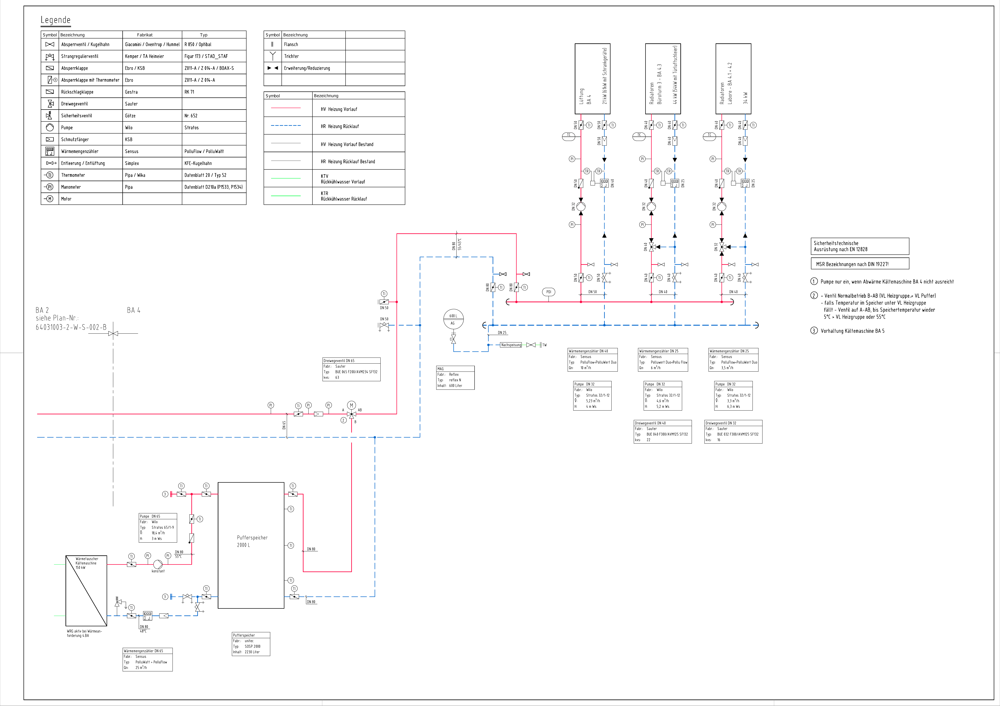

# DiMash Project: Digitization of Plant Diagrams for Energy Performance

**Project Name:** DiMash - Digitization of Plant Diagrams for Increasing the Energy Performance of Existing Buildings

## 📜 Overview

The **DiMash** project enhances the energy performance of existing buildings by digitizing technical plant diagrams using advanced AI techniques. By converting these diagrams into a digital format, we facilitate energy-efficient renovations, improve system monitoring, and develop tools for energy optimization using AI and Building Information Modeling (BIM).

---

## 🎯 Key Goals

* **Facilitate** energy-efficient renovation of existing buildings.
* **Improve** system performance through effective monitoring.
* **Develop** digital tools to support energy optimization.

---

## 🛠️ Project Methodology

The project is structured into several Work Packages (WPs), from research and concept to development, validation, and knowledge transfer. The core technical work is centered around the **TGA Scan Tool**.

### TGA Scan Tool Development (WP2)

This tool automates the interpretation of plant diagrams through a multi-step AI pipeline:

1.  **AP 2.1: Segmentation:** Uses AI models (e.g., DeepLabv3, Mask-RCNN) to separate lines, symbols, and text within a diagram.
2.  **AP 2.2: Topology Detection:** Converts the detected lines into a connected graph data structure, mapping the system's layout.
3.  **AP 2.3: Symbol Recognition:** Identifies components (like pumps, valves, sensors) using models like YOLO and pattern matching against a symbol catalog.
4.  **AP 2.4: Text Recognition:** Employs OCR and clustering algorithms to read and assign labels and specifications to their corresponding components.
5.  **AP 2.5 & 2.6: Consolidation & Data Model:** Integrates all modules and stores the final, structured digital information in a robust data model.

---

## ✨ Project in Action: An Example

This section shows the process of taking a standard heating diagram and processing it with our AI pipeline.

### Input: Original Plant Diagram

This is the raw technical diagram that we use as input.

### Output: AI-based Segmentation

This is the result after our AI model processes the diagram. You can see how different elements like symbols, text, and pipelines have been identified and color-coded.

**Note:** You'll need to upload your results image to the `figures` folder. For this example to work, name it `Heizung_1_segmented.png`.

---

## 🔐 Note on Code Availability

Please note that the source code for this project is hosted in a **private repository** and is not publicly available. This repository serves to document the project's objectives, methodology, and results for demonstration purposes.
